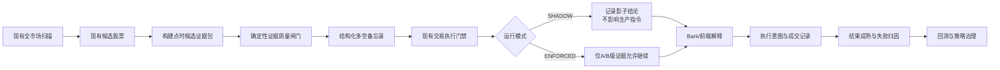

# 候选股证据审查与智能决策增强需求开发文档

**文档版本**：v1.0  
**创建日期**：2026-07-13  
**文档状态**：待评审  
**适用系统**：Alpha Vision A股量化选股与交易辅助系统  
**参考项目**：[simonlin1212/TradingAgents-astock](https://github.com/simonlin1212/TradingAgents-astock)  
**目标读者**：产品负责人、后端开发、前端开发、量化策略开发、测试人员

---

## 1. 文档摘要

本需求在**不修改现有选股逻辑**的前提下，为选出的候选股票增加一层可审计的“证据审查与决策解释”能力，解决以下问题：

1. 当前已经采集了龙虎榜、资金流、解禁、公告、新闻、热点、研报等数据，但这些信息较分散，缺少统一的数据契约和逐股票完整性评级。
2. 当前 Bark 已能明确输出“可交易/不可交易”，但用户仍需要更直观地知道：依据是否完整、主要反证是什么、什么条件会令交易计划失效。
3. 当前已有点时回放、执行意图和结果归因能力，但还缺少从“当时证据”到“最终结果”的结构化错误分类。
4. 数据源异常可能表现为字段缺失、过期或降级缓存；仅检查报告长度或文本格式，无法证明证据真实有效。

本需求借鉴 TradingAgents-astock 的多维投研、质量闸门、多空论证、断点恢复和结果反思思想，但不照搬其多 Agent 决策架构。现有确定性选股、交易门禁、风险控制和执行规则继续拥有最终权威，LLM只能作为可选解释层。

核心原则：

> 规则负责决定能不能交易，证据层负责确认依据是否完整并解释为什么，历史结果负责证明新增门禁是否有效。

---

## 2. 现状与问题

### 2.1 已有能力

系统目前已经具备：

- 多因子选股、A/B等级、价格行为和交易执行判断；
- Bark“指令：可交易/不可交易”及强势异动、观察、禁止追买分组；
- 市场数据覆盖率、异常K线、数据源可用性检查；
- 单股概念、资金流、龙虎榜、解禁、融资、大宗交易、股东户数、公告、新闻和研报数据；
- 点时扫描快照、真实成交约束回放、策略治理和实验工件；
- Bark执行意图及 `ISSUED → FILLED/EXPIRED` 全流程审计；
- 前端研究雷达、股票研究详情、复盘中心和执行收件箱。

主要关联模块：

| 能力 | 当前文件 |
|---|---|
| 全市场数据质量 | `backend/core/data_source_quality.py` |
| 单股研究数据 | `backend/core/stock_research.py` |
| 研究上下文 | `backend/core/research_context.py` |
| 单股研究接口 | `backend/routers/stock.py` |
| 交易执行门禁 | `backend/core/scanner.py` |
| Bark消息 | `backend/core/sentinel.py` |
| 执行意图 | `backend/core/execution_intents.py` |
| 点时执行回放 | `backend/core/execution_replay.py` |
| 策略治理 | `backend/core/strategy_governance.py` |
| 股票详情研究区 | `frontend/src/components/StockDetailPage.tsx` |
| 复盘中心 | `frontend/src/components/ReviewCenter.tsx` |

### 2.2 当前缺口

1. 全市场数据质量正常，不代表某只候选股票的研究证据完整。
2. 单股研究数据没有统一表达“来源、数据时点、新鲜度、是否必需、缺失原因”。
3. 机会标签和风险标签存在，但没有形成统一的看多依据、看空反证、未知项和失效条件。
4. 数据缺失可能只是记录在 `errors` 中，无法稳定影响研究可信度。
5. 现有研究接口主要返回最新数据，历史信号复盘需要更严格的 `signal_date/as_of` 点时约束。
6. 缺少证据质量门禁的影子对照，无法证明增加门禁后究竟是降低误买，还是过度过滤强势股票。

---

## 3. 建设目标

### 3.1 产品目标

- 每只候选股票都生成统一、可追溯的证据包。
- 对证据包执行确定性质量检查，输出 A/B/C/D/F 等级和 `PASS/DEGRADED/BLOCKED` 状态。
- 在不改变现有选股结果的情况下，生成看多、看空、未知项和失效条件。
- Bark继续以“指令：可交易”为唯一执行依据，同时增加简明证据说明。
- 通过影子运行和点时回放验证证据门禁是否改善交易质量。
- 将成交结果与当时证据关联，形成可统计的失败归因。

### 3.2 技术目标

- P0 不新增第三方依赖。
- P0 不新增数据库或数据表，优先复用现有 JSON 快照字段。
- 不修改 `backend/core/strategy.py` 的选股算法。
- 不允许证据层将原本不可交易的股票升级为可交易。
- 不允许LLM直接修改交易资格、仓位、入场价、止损价或目标价。
- 所有历史验证使用信号当时可获得的数据，禁止未来数据泄漏。

### 3.3 非目标

本期明确不做：

- 不引入 LangGraph 或完整多 Agent 框架；
- 不为技术、政策、游资、解禁分别创建独立LLM Agent；
- 不让LLM输出最终买卖资格或自动下单；
- 不改变原选股条件、策略评分和候选股票范围；
- 不因“强势异动”自动生成可交易指令；
- 不新建每只股票一个SQLite检查点数据库；
- 不自动根据复盘结果修改生产阈值。

---

## 4. 总体业务流程



交易权限必须遵循单向约束：

```text
影子模式：
final_trade_eligible = current_trade_eligible

正式门禁模式：
final_trade_eligible = current_trade_eligible AND evidence_quality IN (A, B)
```

任何情况下均不得出现：

```text
current_trade_eligible = false
evidence_quality = A
final_trade_eligible = true
```

证据质量只能维持或降低交易权限，不能提升交易权限。

---

## 5. 术语定义

| 术语 | 定义 |
|---|---|
| 候选证据包 | 某只股票在某个信号时点可获得的行情、技术、板块、资金、事件和风险数据快照 |
| 核心证据 | 缺失后无法判断能否实际交易的数据，例如实时价格、交易状态、确认价、止损价 |
| 条件必需证据 | 仅在特定策略中必需的证据，例如事件驱动策略的事件来源和发布时间 |
| 可选证据 | 缺失不会单独否决交易，但会降低解释完整性的证据 |
| 证据质量等级 | A/B/C/D/F，对证据完整性、时效性和一致性的确定性评级 |
| 证据门禁状态 | `PASS`、`DEGRADED`、`BLOCKED` |
| 决策备忘录 | 基于同一证据包生成的看多依据、看空反证、未知项和失效条件 |
| 影子模式 | 计算并保存新逻辑结果，但不影响生产交易资格和Bark指令 |
| 正式门禁模式 | 验证通过后，证据质量参与最终交易资格判断 |
| 结果归因 | 将后续成交和收益结果归类为方向、入场、执行、数据或风控问题 |

---

## 6. 功能需求

### 6.1 CEQ-001 统一候选证据包

**优先级**：P0  
**目标**：把当前分散的研究数据转为统一、可审计、可点时回放的数据结构。

### 输入

- 当前扫描候选股票；
- 扫描时点 `signal_time/as_of`；
- 当前行情及价格行为结果；
- 市场情绪和板块状态；
- `build_stock_research_signals()` 已有研究数据；
- 当前交易阻断项和执行计划。

### 输出

统一的 `candidate_evidence_bundle`，至少包含：

- 唯一标识；
- 股票、策略和信号时间；
- 证据域；
- 每条证据的来源和时间；
- 缺失和错误信息；
- 证据质量结果；
- 决策备忘录；
- 契约版本。

### 验收标准

- [ ] 同一只股票、同一策略、同一信号时点生成稳定的证据标识。
- [ ] 所有证据包含 `source`、`observed_at`、`status` 和 `missing_reason`。
- [ ] 证据时间晚于 `as_of` 时必须标记为 `FUTURE_DATA`，且不得用于评级。
- [ ] 数据源调用失败时返回结构化缺失状态，不得用空字符串伪装成功。
- [ ] 证据包可被JSON序列化，且不包含Token、Cookie、数据库连接信息等凭证。
- [ ] 不因可选证据缺失而中断整只股票的扫描流程。

---

### 6.2 CEQ-002 分策略证据清单

**优先级**：P0  
**目标**：明确哪些数据是所有交易必需，哪些仅在特定策略中必需。

### 证据域定义

| 证据域 | 默认级别 | 内容 | 缺失后的默认处理 |
|---|---|---|---|
| `quote` | 核心必需 | 现价、行情时间、涨跌停状态、停复牌状态 | BLOCKED |
| `execution_plan` | 核心必需 | 确认价、止损价、盈亏比、交易动作 | BLOCKED |
| `technical_structure` | 核心必需 | 趋势、形态、位置、量价和信号类型 | BLOCKED |
| `market_regime` | 必需 | 市场阶段、风险状态、总仓上限 | DEGRADED/BLOCKED，沿用现有门禁语义 |
| `sector_context` | 必需 | 板块状态、主线状态、相对强度 | DEGRADED，不得提升权限 |
| `event_catalyst` | 条件必需 | 公告、新闻、热点原因、政策催化 | 事件策略缺失时 BLOCKED；其他策略可选 |
| `money_flow` | 可选 | 主力资金、龙虎榜、融资、大宗交易 | 降为B级或记录未知项 |
| `supply_risk` | 可选 | 解禁、减持、股东变化 | 降级或形成反证，不新设交易阈值 |
| `fundamentals` | 可选 | 业绩、估值、盈利预测、研报 | 降为B级或记录未知项 |
| `news_policy` | 可选 | 公司新闻、行业政策、监管事件 | 降级或记录未知项 |

### 规则要求

- 事件驱动候选必须能够追溯事件标题、来源、发布时间和首次可见时间。
- 非事件策略不得因为事件数据缺失直接获得加分或被升级。
- 已确认的解禁、减持等风险只形成结构化反证；是否阻断交易仍沿用现有规则，除非后续经过独立回测和审批。
- 所有新增时间阈值必须集中配置，禁止在多个模块散落魔法数字。

### 验收标准

- [ ] 普通候选和事件驱动候选使用不同的必需证据清单。
- [ ] 新增证据域不要求修改多条Agent路由或重复注入多个Prompt。
- [ ] 证据清单和评级逻辑具有单元测试。
- [ ] 缺失条件必需证据时，输出明确的中文原因。

---

### 6.3 CEQ-003 确定性证据质量闸门

**优先级**：P0  
**目标**：不用LLM，仅根据原始证据的完整性、时间和一致性生成评级。

### 评级规则

| 等级 | 门禁状态 | 定义 | 交易影响 |
|---|---|---|---|
| A | PASS | 所有核心和条件必需证据有效，无高严重度缺失 | 可继续执行现有门禁结论 |
| B | PASS | 所有必需证据有效，但存在一个或多个可选证据缺失/降级 | 可继续执行现有门禁结论，同时提示证据不足 |
| C | DEGRADED | 非执行核心证据存在时效或一致性问题，暂不足以支持明确执行 | 只能观察或等待确认 |
| D | BLOCKED | 任一核心必需证据缺失、过期或冲突 | 不可交易 |
| F | BLOCKED | 行情/交易状态无效，或证据包无法构建 | 不可交易 |

### 硬检查

至少检查：

- 必需字段是否存在；
- 数值是否合法，是否存在 NaN/Inf；
- 证据日期是否晚于信号时点；
- 行情是否过期；
- 股票代码是否一致；
- 价格、确认价、止损价的基本关系是否有效；
- 数据源是否明确返回失败或限流；
- 不同来源是否存在关键字段冲突；
- 缓存是否属于过期降级数据；
- 事件发布时间是否可以在信号时点获得。

### 关键约束

- 评级不能依赖报告字数、是否包含表格等文本形式指标。
- LLM复审失败不能导致等级提升。
- 证据质量为A/B不能覆盖现有 `trade_blockers`。
- C/D/F不得创建新的Bark执行意图。

### 验收标准

- [ ] 相同证据输入始终得到相同评级。
- [ ] 可选数据缺失最多降为B，不应使扫描任务失败。
- [ ] 实时行情缺失或过期时必须为D/F。
- [ ] 当前不可交易股票即使评级A，也仍然不可交易。
- [ ] 评级结果包含机器可读原因码和中文说明。
- [ ] 每一种等级至少有一个单元测试样例。

---

### 6.4 CEQ-004 结构化多空决策备忘录

**优先级**：P0  
**目标**：从同一证据包中提取看多依据、看空反证、未知项和失效条件。

### 输出字段

- `bull_case`：最多3项，必须引用证据ID；
- `bear_case`：最多3项，必须引用证据ID；
- `unknowns`：最多3项，记录缺失、过期或冲突信息；
- `invalidation_conditions`：复用现有止损、结构失效和板块退潮信号；
- `summary`：面向用户的简短说明；
- `generated_by`：`RULES` 或 `LLM_SUMMARY`。

### 生成规则

- P0 完全由确定性规则生成。
- 不新增独立“政策分析师、游资分析师、解禁分析师”类。
- 多空观点必须来自同一份点时证据包。
- 未知数据必须进入 `unknowns`，不能被解释成中性或利好。
- 不重新计算或覆盖现有入场价、止损价、目标价和仓位。

### 验收标准

- [ ] 每个看多/看空条目都能追溯到证据ID。
- [ ] 没有证据支持时不生成主观观点。
- [ ] 失效条件与现有执行计划保持一致。
- [ ] 同一输入的规则版备忘录可重复生成。
- [ ] 备忘录不包含“保证上涨、必涨、稳赚”等确定性承诺。

---

### 6.5 CEQ-005 API与扫描结果兼容扩展

**优先级**：P0  
**目标**：通过现有接口附加证据字段，避免新增不必要的API。

### 单股研究接口

扩展现有接口：

```http
GET /api/stock/{code}/research?signal_date=YYYY-MM-DD&force_refresh=false
```

新增查询参数：

| 参数 | 类型 | 必填 | 说明 |
|---|---|---|---|
| `signal_date` | date | 否 | 为空时返回最新研究；提供时必须按该日期执行点时约束 |
| `force_refresh` | boolean | 否 | 保留现有语义；历史日期不得获取当时不可见的未来信息 |

新增响应字段只允许追加，不删除或重命名已有字段：

```json
{
  "evidence_bundle": {},
  "evidence_quality": {},
  "decision_memo": {}
}
```

### 扫描结果

候选股票允许增加以下紧凑字段：

```json
{
  "evidence_id": "ev_...",
  "evidence_grade": "A",
  "evidence_status": "PASS",
  "evidence_summary": "核心证据完整，可选资金数据部分缺失",
  "evidence_blockers": [],
  "decision_memo": {
    "bull": ["板块主线维持"],
    "bear": ["短线涨幅偏高"],
    "invalidation": ["跌破计划止损价"]
  }
}
```

### 验收标准

- [ ] 旧前端忽略新增字段后仍能正常运行。
- [ ] 不删除、不重命名现有字段。
- [ ] `signal_date` 参数有格式和范围校验。
- [ ] 历史日期请求不能混入最新公告、新闻或资金数据。
- [ ] API返回中不出现Python对象、NaN或不可序列化值。

---

### 6.6 CEQ-006 Bark证据增强

**优先级**：P0，但必须在影子验证后启用  
**目标**：在不改变原指令语义的情况下，使Bark更清楚地表达依据和风险。

### 消息格式

保留现有首行：

```text
指令：可交易｜...｜A级可交易 股票名称(代码)
```

在候选详情中追加：

```text
  证据：A级｜核心证据完整
  看多：板块主线增强；量价确认
  反证：短线涨幅偏高
  失效：跌破计划止损价
  时点：行情 10:31｜研究 10:29
```

### 消息长度控制

- 证据等级：1行；
- 看多：最多2项；
- 反证：最多1项；
- 失效条件：最多1项；
- 数据时点：1行；
- 完整证据在前端股票详情或复盘中心查看。

### 行为约束

- 仍然只有看到“指令：可交易”才能执行。
- 强势异动、观察、禁止追买不得因证据A级变成可交易。
- 影子阶段不改变Bark分组和执行意图创建逻辑。
- 正式门禁阶段，C/D/F候选不得显示“指令：可交易”。
- 推送改动只增加字段，不改变原字段顺序和核心文案。

### 验收标准

- [ ] 现有“指令：可交易”文本保持不变。
- [ ] Bark新增内容不会把观察候选描述成交易机会。
- [ ] 证据缺失时显示“缺失/过期”，不得生成虚构依据。
- [ ] Bark发送失败时不创建执行意图。
- [ ] 只有最终明确可交易且发送成功的股票创建执行意图。

---

### 6.7 CEQ-007 影子运行与点时验证

**优先级**：P0  
**目标**：证明证据门禁的实际价值，防止系统因过度严格继续漏掉强势股票。

### 运行模式

配置项：

```text
EVIDENCE_GATE_MODE = OFF | SHADOW | ENFORCED
```

- `OFF`：不构建证据门禁结果；
- `SHADOW`：计算、保存和回测，但不改变生产交易资格；
- `ENFORCED`：仅经审批后启用，A/B可继续，C/D/F降级或阻断。

默认上线模式必须为 `SHADOW`。

### 对照组

| 策略组 | 定义 |
|---|---|
| `current_policy` | 当前生产交易逻辑 |
| `evidence_shadow` | 当前逻辑 + 证据门禁影子结果 |
| `evidence_enforced_simulation` | 模拟仅保留A/B证据候选 |

### 评价指标

- 成熟信号数；
- 可交易数量和过滤比例；
- 真实可成交率；
- 1/3/5/10日收益；
- 胜率；
- 平均收益与中位数收益；
- Profit Factor；
- 最大回撤；
- 高开、涨停、无成交数量；
- 证据等级分层表现；
- 被证据门禁阻断后仍上涨的强势股票数量；
- 被门禁阻断且避免亏损的数量；
- 各证据缺失原因分布。

### 强势股漏选专项

必须单独分析：

- 当日涨幅较高候选；
- 近5日强势候选；
- 涨停/近涨停候选；
- 事件驱动候选；
- 板块主线候选。

证据门禁只能判断证据是否足够，不能把“近期上涨”本身当作证据质量差。是否追高仍由现有交易执行逻辑决定。

### 启用正式门禁的条件

- [ ] 通过未来数据泄漏审计。
- [ ] 成熟样本不少于现有策略治理最低要求；不足时继续影子运行。
- [ ] A/B组的期望收益或Profit Factor相对当前策略有改善，或在收益不退化的情况下明显降低回撤。
- [ ] 已统计并人工抽查被过滤的强势盈利样本。
- [ ] 数据源缺失不是主要过滤原因；若是，应先修复数据源。
- [ ] 用户明确批准从 `SHADOW` 切换到 `ENFORCED`。

---

### 6.8 CEQ-008 前端证据展示

**优先级**：P1  
**目标**：在现有股票详情和复盘中心展示证据，不新增独立复杂页面。

### 股票详情页

在现有研究区域增加：

- 证据等级和状态；
- 数据时间和来源；
- 各证据域状态；
- 看多依据；
- 看空反证；
- 未知项；
- 失效条件；
- 完整缺失原因。

### 复盘中心

增加：

- A/B/C/D/F分布；
- 不同等级的成熟收益；
- 主要缺失项排行；
- 被门禁阻断后上涨/下跌的样本；
- 当前策略与证据影子策略对照。

### 验收标准

- [ ] 数据缺失、加载中和接口失败有不同状态。
- [ ] 颜色不是唯一的信息表达方式，必须同时有文字等级。
- [ ] 旧扫描历史没有证据字段时正常显示“历史记录暂无证据快照”。
- [ ] 移动端不会因证据详情导致横向溢出。
- [ ] 前端不自行重新计算证据等级。

---

### 6.9 CEQ-009 交易后结构化结果归因

**优先级**：P1  
**目标**：把真实结果关联到信号时点证据，形成可统计的学习闭环。

### 归因分类

| 分类 | 示例 |
|---|---|
| `DIRECTION_CORRECT` | 方向正确，达到预期收益 |
| `DIRECTION_WRONG` | 方向判断错误 |
| `ENTRY_TOO_LATE` | 方向正确但入场位置过高 |
| `NO_FILL` | 涨停、高开或流动性原因未成交 |
| `SECTOR_FAILED` | 个股条件存在但板块退潮 |
| `CATALYST_FAILED` | 事件催化没有延续 |
| `DATA_MISSING` | 关键证据在信号时缺失 |
| `DATA_STALE` | 使用了过期或降级数据 |
| `RISK_GATE_SAVED_LOSS` | 风控阻止了一笔后续亏损交易 |
| `RISK_GATE_MISSED_WINNER` | 风控阻止了一笔后续显著上涨交易 |
| `EXECUTION_DEVIATION` | 实际成交价、仓位与计划偏离 |

### 约束

- 归因首先由确定性规则生成。
- 一笔交易允许一个主因和多个次因。
- LLM只能把结构化归因总结为文字，不得覆盖原始归因。
- 归因结果不得自动修改生产阈值。

### 验收标准

- [ ] 每条成熟执行意图可关联证据ID和信号快照。
- [ ] 未成交与策略方向错误必须分开统计。
- [ ] 风控避免亏损和风控漏掉强股必须同时统计。
- [ ] 归因可按策略、市场阶段、证据等级查询。

---

### 6.10 CEQ-010 分阶段任务状态与恢复

**优先级**：P1  
**目标**：研究数据源部分失败后能够恢复，不重复完成全部工作。

### 状态定义

```text
PENDING
→ MARKET_DATA_READY
→ RESEARCH_READY
→ QUALITY_CHECKED
→ DECISION_READY
→ PUSHED
→ OUTCOME_MATURED
```

### 设计约束

- 复用现有数据库、Celery任务状态或JSON审计字段。
- 不新建每只股票一个SQLite数据库。
- 同一股票、策略、信号时点的任务ID必须确定且幂等。
- 恢复任务时不得重新拉取会破坏点时一致性的未来数据。
- 阶段失败必须保存失败阶段和简要原因。

### 验收标准

- [ ] 同一任务重复执行不会产生重复Bark或重复执行意图。
- [ ] 研究数据失败后可以从失败阶段安全重试。
- [ ] 重试不会改变原信号时点。
- [ ] 任务状态可以在运维或复盘接口中查看。

---

### 6.11 CEQ-011 数据适配器契约测试与监控

**优先级**：P1  
**目标**：确保关键数据源不仅“请求成功”，而且字段、日期和单位正确。

### 每个适配器至少检查

- HTTP/接口调用结果；
- 返回类型；
- 非空记录；
- 必需字段；
- 股票代码匹配；
- 数据日期与时区；
- 金额、百分比和手/股单位；
- 限流和封禁识别；
- 降级缓存标识；
- 数据源切换后的字段一致性。

### 当前数据源要求

- 保留现有东财统一 `em_get()` 串行节流和Session复用。
- 增加调用成功率、延迟、限流次数和过期缓存次数指标。
- 单一可选数据源异常不得拖垮全市场扫描。
- 核心行情数据源异常必须中止可交易推送，而不是静默使用旧数据。

### 验收标准

- [ ] 核心数据适配器均有正常、空数据和异常返回测试。
- [ ] 测试不依赖真实Token或私有凭证。
- [ ] 数据源错误能映射为证据缺失原因码。
- [ ] 运维中心能看到主要数据源健康情况。

---

### 6.12 CEQ-012 可选LLM解释层

**优先级**：P2  
**前置条件**：P0/P1确定性版本完成且有影子验证数据。  
**目标**：提高文字解释质量，不参与交易权限计算。

### 调用范围

- 只对扫描后少量候选调用；
- 不用于全市场扫描；
- 只读取完整的点时候选证据包；
- 使用结构化输出；
- 模型超时或失败时退回规则版备忘录。

### 权限边界

LLM不得：

- 将不可交易改为可交易；
- 修改仓位、止损、目标或确认价；
- 引用证据包之外的实时信息；
- 自动修改策略参数；
- 将未知数据描述成已确认事实。

### 输出要求

```json
{
  "bull_summary": "string",
  "bear_summary": "string",
  "unknown_summary": "string",
  "risk_reminder": "string",
  "cited_evidence_ids": ["ev_item_1"]
}
```

### 验收标准

- [ ] JSON Schema验证失败时丢弃LLM结果。
- [ ] 引用不存在的证据ID时丢弃对应观点。
- [ ] LLM关闭或不可用时交易主链正常工作。
- [ ] 模型版本、Prompt版本和调用时点进入审计记录。

---

## 7. 数据契约

### 7.1 候选证据包示例

```json
{
  "contract_version": "candidate-evidence-v1",
  "evidence_id": "ev_20260713_000001_tv_dual_strict",
  "code": "000001",
  "name": "示例股票",
  "strategy_type": "tv_dual_strict",
  "signal_time": "2026-07-13T10:31:00+08:00",
  "as_of": "2026-07-13T10:31:00+08:00",
  "domains": {
    "quote": {
      "requirement": "CORE",
      "status": "AVAILABLE",
      "source": "realtime_snapshot",
      "observed_at": "2026-07-13T10:30:58+08:00",
      "freshness": "FRESH",
      "items": {
        "price": 12.34,
        "pct": 3.21,
        "limit_state": "NORMAL"
      },
      "missing_reason": null
    },
    "money_flow": {
      "requirement": "OPTIONAL",
      "status": "UNAVAILABLE",
      "source": "eastmoney",
      "observed_at": null,
      "freshness": "UNKNOWN",
      "items": {},
      "missing_reason": "SOURCE_TIMEOUT"
    }
  },
  "quality": {
    "grade": "B",
    "status": "PASS",
    "reason_codes": ["OPTIONAL_MONEY_FLOW_UNAVAILABLE"],
    "summary": "核心证据完整，可选资金数据缺失",
    "evaluated_by": "RULES"
  },
  "decision_memo": {
    "bull_case": [
      {
        "text": "板块主线状态有效",
        "evidence_ids": ["sector_context.mainline"]
      }
    ],
    "bear_case": [
      {
        "text": "短线位置偏高，不适合追涨",
        "evidence_ids": ["technical_structure.extension"]
      }
    ],
    "unknowns": ["资金流接口超时"],
    "invalidation_conditions": ["跌破计划止损价"]
  }
}
```

### 7.2 状态枚举

证据状态：

```text
AVAILABLE
UNAVAILABLE
STALE
CONFLICT
FUTURE_DATA
INVALID
NOT_APPLICABLE
```

新鲜度状态：

```text
FRESH
STALE
UNKNOWN
```

缺失原因码至少包括：

```text
SOURCE_TIMEOUT
SOURCE_RATE_LIMITED
SOURCE_BLOCKED
EMPTY_RESPONSE
REQUIRED_FIELD_MISSING
CODE_MISMATCH
DATE_MISMATCH
FUTURE_DATA_REJECTED
STALE_CACHE_ONLY
INVALID_VALUE
NOT_COLLECTED
```

---

## 8. 数据存储与兼容方案

### 8.1 P0方案

为避免新增数据库结构，优先采用：

- 扫描历史的现有JSON详情保存紧凑版证据质量和决策备忘录；
- 单股研究接口按需返回完整证据包；
- 执行意图 `signal_snapshot` 只保存 `evidence_id`、等级、原因码和摘要；
- 实验工件保存影子对照汇总和版本信息。

### 8.2 数据体积约束

- 扫描历史不重复保存完整新闻、公告和研报正文；
- 只保存来源、标题、时间、关键数值和内容哈希；
- Bark执行意图不复制完整研究包；
- 相同证据内容允许通过 `evidence_id/content_hash` 引用。

### 8.3 后续迁移条件

只有出现以下情况才考虑新增独立证据表：

- JSON字段明显影响查询性能；
- 需要按证据项跨股票统计；
- 单条扫描快照体积不可接受；
- 需要长期不可变证据审计。

若新增表，必须另行说明影响并使用无损、向下兼容的 `CREATE TABLE/ALTER TABLE ADD COLUMN` 迁移，不得删除或重写历史扫描、执行意图和模拟交易数据。

---

## 9. 建议代码改动范围

以下为开发阶段的预期范围，不代表本需求文档已经实施：

### 后端

| 文件 | 预期改动 |
|---|---|
| `backend/core/candidate_evidence.py` | 新增最小证据包构建、确定性评级和规则备忘录 |
| `backend/core/stock_research.py` | 复用已有数据，补充来源、时点和缺失状态 |
| `backend/core/scanner.py` | 接入影子结果；正式模式只允许降低权限 |
| `backend/core/sentinel.py` | Bark只增证据字段，保持指令语义 |
| `backend/core/execution_intents.py` | `signal_snapshot`增加证据ID和等级 |
| `backend/core/execution_replay.py` | 增加当前策略与证据门禁影子对照 |
| `backend/core/risk_constants.py` | 集中保存新增时效阈值和模式配置 |
| `backend/routers/stock.py` | 现有研究接口增加 `signal_date` 和附加字段 |

### 前端

| 文件 | 预期改动 |
|---|---|
| `frontend/src/components/StockDetailPage.tsx` | 研究区增加证据等级、多空和未知项 |
| `frontend/src/components/ReviewCenter.tsx` | 增加证据等级分层和影子对照 |
| `frontend/src/lib/api.ts` | 增加附加字段类型定义，不破坏旧字段 |

### 测试

| 文件 | 预期改动 |
|---|---|
| `backend/tests/test_candidate_evidence.py` | 新增证据契约与评级单元测试 |
| `backend/tests/test_realtime_bark_data.py` | 验证Bark兼容和指令权限 |
| `backend/tests/test_execution_replay.py` | 验证点时影子对照 |
| `backend/tests/test_execution_intents.py` | 验证只有最终可交易才创建意图 |

禁止为实现本需求顺便重构 `backend/core/strategy.py` 或清理无关旧代码。

---

## 10. 测试计划

### 10.1 单元测试

- 核心证据完整得到A级；
- 可选资金数据缺失得到B级；
- 非核心必需证据过期得到C级；
- 实时行情过期得到D级；
- 证据包无法构建得到F级；
- 事件策略缺少事件发布时间被阻断；
- 普通策略缺少事件数据不被错误阻断；
- 未来日期证据被拒绝；
- 股票代码不一致被拒绝；
- 证据A级不能提升现有不可交易候选；
- LLM异常不改变交易资格；
- 同一输入得到相同评级和备忘录。

### 10.2 集成测试

- 单股研究接口向下兼容；
- 扫描结果新增字段可序列化；
- Bark首行和“仅可交易才执行”规则不变；
- C/D/F不创建执行意图；
- 影子模式不改变当前生产候选数量；
- 任务重试不重复推送；
- 历史日期研究不混入未来信息；
- 数据源超时不会导致扫描服务崩溃。

### 10.3 回测与影子验证

- 使用现有点时扫描快照；
- 按不同市场阶段、策略和证据等级分层；
- 使用真实A股次日开盘、涨跌停、T+1、费用、滑点和容量约束；
- 对照当前策略和证据门禁模拟策略；
- 输出被过滤的盈利/亏损样本明细；
- 保留不可变实验ID、代码版本和数据版本；
- 样本不足时必须输出“未验证”，不得输出“策略有效”。

### 10.4 前端验证

```bash
cd frontend
npm run type-check
npm run build
```

验证：

- 旧数据无证据字段时不报错；
- 加载、空数据、部分数据和失败状态可区分；
- 移动端展示正常；
- Bark以外的前端文案不把观察描述成可交易。

---

## 11. 分阶段交付计划

### 阶段一：P0证据契约与确定性评级

- 新增证据包；
- 新增分策略必需清单；
- 新增A/B/C/D/F评级；
- 新增规则版多空备忘录；
- 完成单元测试。

**完成定义**：可以对任意候选生成稳定、可解释、无未来数据的证据结果。

### 阶段二：影子接入与回测

- 接入扫描历史；
- 扩展研究接口；
- 增加影子对照；
- 输出强势股漏选专项报告。

**完成定义**：生产交易资格完全不变，但可以得到证据门禁的历史和实时模拟结果。

### 阶段三：Bark与前端解释

- Bark增加简明证据字段；
- 股票详情增加完整证据；
- 复盘中心增加等级分层。

**完成定义**：用户能清楚看到证据完整性、主要反证和失效条件，且原执行指令语义不变。

### 阶段四：结果归因与任务恢复

- 增加结构化归因；
- 增加阶段状态和幂等恢复；
- 增加数据适配器契约测试和监控。

**完成定义**：能够区分策略错误、数据错误、执行问题、有效风控和过严风控。

### 阶段五：可选LLM解释

- 在少量候选上运行；
- 只输出结构化解释；
- 与规则版做稳定性和成本对照。

**完成定义**：LLM关闭或失败不影响任何交易功能，并且不能改变交易资格。

---

## 12. 风险与应对

| 风险 | 影响 | 应对措施 |
|---|---|---|
| 证据门禁过严 | 漏掉强势股票 | 默认影子运行，单独统计被过滤强势盈利样本 |
| 免费数据源不稳定 | 大量候选被错误降级 | 区分核心/可选数据，先修数据源再启用正式门禁 |
| 历史新闻存在未来数据 | 回测结果虚高 | 强制 `published_at <= as_of`，纳入未来数据审计 |
| 证据包过大 | 数据库和API变慢 | 只存摘要、哈希和引用，不保存全文 |
| Bark过长 | 用户无法快速执行 | 每只候选最多追加5行，完整内容放前端 |
| LLM产生幻觉 | 误导交易判断 | P0不用LLM；P2必须引用证据ID且无交易权限 |
| 多处重复评级 | 前后端结论不一致 | 后端为唯一评级来源，前端只展示 |
| 新逻辑影响旧历史 | 历史页面报错 | 所有新增字段可选，缺失时显示暂无快照 |

---

## 13. 上线、回滚与运维

### 上线顺序

```text
OFF → SHADOW → 人工评审/回测 → ENFORCED
```

不得跳过影子阶段直接启用正式门禁。

### 回滚

- 发现误降级、数据源大面积异常或Bark文案冲突时，将模式切回 `SHADOW` 或 `OFF`；
- 回滚不删除已生成证据和实验记录；
- 关闭证据层后恢复当前生产交易资格逻辑；
- LLM解释层必须可以独立关闭。

### 运维指标

- 每日证据包构建成功率；
- A/B/C/D/F分布；
- 各证据域缺失率；
- 数据源超时、限流和过期缓存次数；
- 平均构建耗时和P95耗时；
- Bark消息长度和发送失败率；
- 证据门禁模拟过滤率；
- `RISK_GATE_SAVED_LOSS` 与 `RISK_GATE_MISSED_WINNER` 数量。

---

## 14. 总体验收标准

本需求完成必须同时满足：

- [ ] 未修改现有选股算法和策略评分逻辑。
- [ ] 未增加新的生产数据库或每股SQLite数据库。
- [ ] 未新增不必要的第三方依赖。
- [ ] 每只候选都能得到可追溯的证据质量结果。
- [ ] 证据质量只能降低、不能提升现有交易权限。
- [ ] 影子模式下生产交易结果与改造前一致。
- [ ] Bark仍以“指令：可交易”为唯一可执行标识。
- [ ] 强势异动仍然只观察，除非现有门禁后来明确判为可交易。
- [ ] 所有历史验证通过点时和未来数据泄漏审计。
- [ ] 数据不足时明确显示“未验证”。
- [ ] 后端相关测试、前端类型检查和生产构建通过。
- [ ] 正式门禁启用前有独立回测报告和用户批准。

---

## 15. 架构决策记录

### ADR-CEQ-001：不引入完整多 Agent 决策框架

**决定**：采用统一证据包和确定性评级，不引入7个独立LLM Agent。  
**原因**：现有数据采集已覆盖主要维度，多Agent会增加成本、延迟、重复分析和不可复现性。  
**后果**：保留现有FastAPI、Celery和React架构，新增模块保持最小。

### ADR-CEQ-002：LLM不拥有交易权限

**决定**：LLM只能总结证据，不能改变买卖资格和交易参数。  
**原因**：交易决策必须可回测、可复现、可审计。  
**后果**：LLM失败时系统自动使用规则版备忘录，交易主链不受影响。

### ADR-CEQ-003：先影子运行再启用门禁

**决定**：新证据逻辑默认 `SHADOW`。  
**原因**：新增门禁可能降低误买，也可能进一步漏掉强势股票，必须用点时数据验证。  
**后果**：正式启用属于独立策略治理变更，需要实验工件和用户批准。

### ADR-CEQ-004：P0不新增数据库结构

**决定**：优先复用现有JSON快照、研究接口和实验工件。  
**原因**：当前需求可以在现有存储能力内完成，新增表会增加迁移和一致性成本。  
**后果**：先监控数据体积和查询性能，达到明确条件后再评估无损迁移。

---

## 16. 参考资料

- [TradingAgents-astock](https://github.com/simonlin1212/TradingAgents-astock)
- [TradingAgents-astock 质量闸门](https://github.com/simonlin1212/TradingAgents-astock/blob/main/tradingagents/agents/quality_gate.py)
- [TradingAgents-astock A股改造说明](https://github.com/simonlin1212/TradingAgents-astock/blob/main/CHANGES_FROM_UPSTREAM.md)
- `docs/EXECUTION_STRATEGY_SCIENCE_AUDIT_2026-07-11.md`
- `docs/UPDATED_EXECUTION_STRATEGY_BACKTEST_2026-07-11.md`
- `docs/CONTINUOUS_STABILITY_RESEARCH_2026-07-12.md`
- `docs/PRODUCTION_HARDENING_2026-07-12.md`

---

**最终原则**：本功能用于提高证据完整性、可解释性和复盘质量，不承诺提高胜率；只有经过点时回测和影子运行证明有效，才允许影响生产“可交易”指令。
